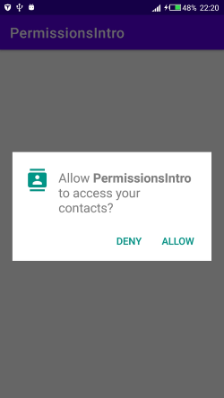
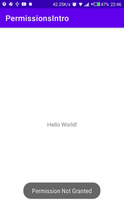
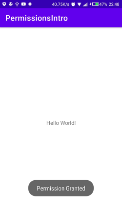
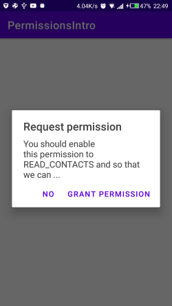

# Demonstration of Requesting Run-Time Permissions

1. Upon first time launch

2. On pressing deny

3. On pressing allow

4. On relaunching the app after pressing deny

5. On relaunching the app after pressing deny

6. On relaunching the app after pressing deny then no

7. On relaunching the app after pressing deny then yes







## MainActivity.kt

```Kotlin
class MainActivity : AppCompatActivity() {

    private val MY_PERMISSION_REQUEST_READ_CONTACTS = 1

    override fun onCreate(savedInstanceState: Bundle?) {
        super.onCreate(savedInstanceState)
        setContentView(R.layout.activity_main)

        //CHECK IF PERMISSION IS GRANTED OR NOT
        when {
            ContextCompat.checkSelfPermission(this, Manifest.permission.READ_CONTACTS) == PackageManager.PERMISSION_GRANTED -> {
                Toast.makeText(this, "Permission already Granted", Toast.LENGTH_LONG).show()
                // permission has already been granted
                //performAction(...)
            }
            shouldShowRequestPermissionRationale(Manifest.permission.READ_CONTACTS) -> {
                val builder = AlertDialog.Builder(this)
                builder.setTitle("Request permission")
                builder.setMessage("You should enable this permission to READ_CONTACTS and so that we can ...")
                builder.setNegativeButton("No") { dialogInteface, which ->
                    ActivityCompat.requestPermissions(this, arrayOf(Manifest.permission.READ_CONTACTS), MY_PERMISSION_REQUEST_READ_CONTACTS)
                }
                builder.setPositiveButton("Grant Permission") { dialogInteface, which ->
                    ActivityCompat.requestPermissions(this, arrayOf(Manifest.permission.READ_CONTACTS), MY_PERMISSION_REQUEST_READ_CONTACTS)
                }
                builder.show()
            }
            else -> {
                // You can directly ask for the permission.
                ActivityCompat.requestPermissions(this, arrayOf(Manifest.permission.READ_CONTACTS), MY_PERMISSION_REQUEST_READ_CONTACTS)
            }
        }
    }

    override fun onRequestPermissionsResult(requestCode: Int, permissions: Array<out String>, grantResults: IntArray) {
        when (requestCode) {
            MY_PERMISSION_REQUEST_READ_CONTACTS -> {
                // If request is cancelled, the result arrays are empty.
                if ((grantResults.isNotEmpty() && grantResults[0] == PackageManager.PERMISSION_GRANTED)) {
                    // Permission is granted. Continue the action or workflow in your app.
                    Toast.makeText(this, "Permission Granted", Toast.LENGTH_LONG).show()
                } else {
                    // Explain to the user that the feature is unavailable because
                    // the features requires a permission that the user has denied.
                    // At the same time, respect the user's decision. Don't link to
                    // system settings in an effort to convince the user to change
                    // their decision.
                    Toast.makeText(this, "Permission Not Granted", Toast.LENGTH_LONG).show()
                }
                return
            }
            // Add other 'when' lines to check for other
            // permissions this app might request.
            else -> {
                // Ignore all other requests.
            }
        }
    }
}
```
